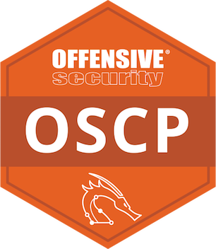
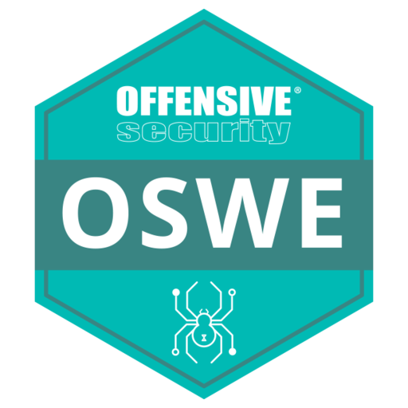
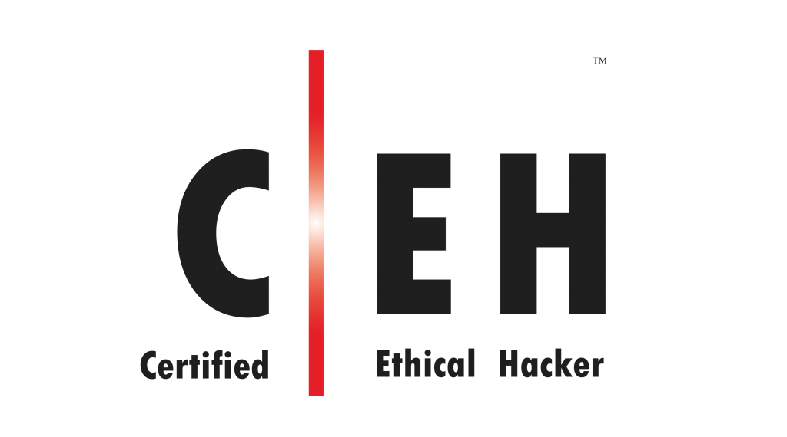
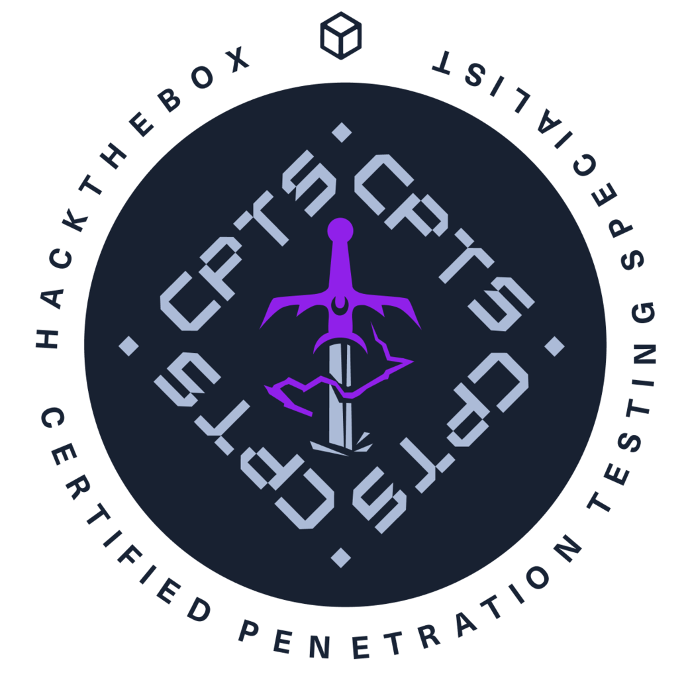
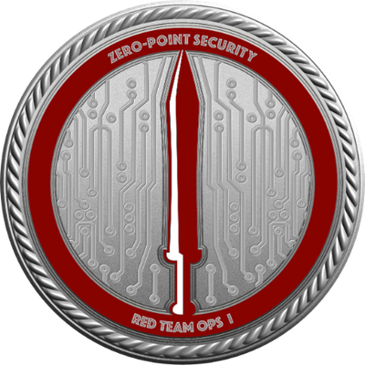
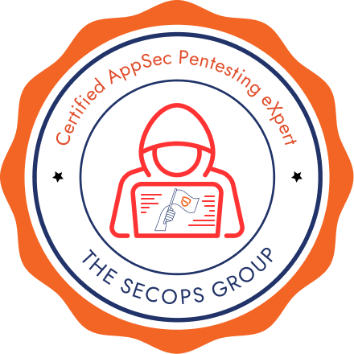
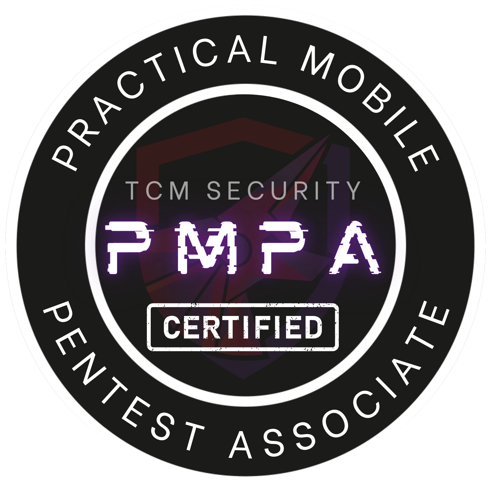
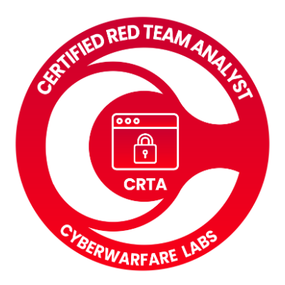

# Our Certifications

Industry-recognized offensive-security certifications held across the Red Matcha
team, covering every domain we deliver. Listed in order of relevance to our
core service offering.

| Certification | Full name | Issuer | Domain |
| --- | --- | --- | --- |
|  | **OSCP**, Offensive Security Certified Professional | OffSec | Network / Infrastructure |
|  | **OSWE**, Offensive Security Web Expert | OffSec | Web Application |
|  | **CEH**, Certified Ethical Hacker | EC-Council | General Offensive Security |
|  | **CPTS**, Certified Penetration Testing Specialist | Hack The Box | Network / Infrastructure |
|  | **CRTO**, Certified Red Team Operator | Zero-Point Security | Red Teaming |
|  | **CAPenX**, Certified AppSec Pentesting eXpert | The SecOps Group | Web / API |
|  | **PMPA**, Practical Mobile Pentest Associate | TCM Security | Mobile Application |
|  | **CRTA**, Certified Red Team Analyst | CyberWarfare Labs | Red Teaming |
|  | **eJPT**, eLearnSecurity Junior Penetration Tester | INE | Network / Infrastructure |

> Certification badges are the property of their respective issuers and are shown
> to evidence credentials held by team members.
